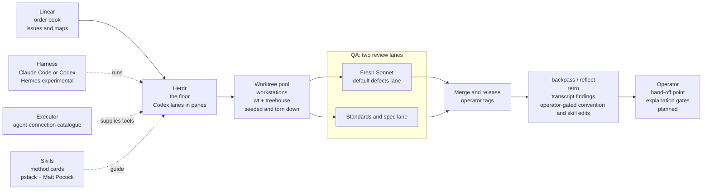

# impstack

impstack, imperfect operator.

**This is my opinionated blueprint for a personal code factory.** I connect its order book,
workstations, review lanes, release, and retro in one line.

**I am the imperfect part it is designed around.** I add hand-off points and explanation gates where
speed tempts me to accept work that I have stopped following.

## install

```bash
git clone https://github.com/ivankqw/agents-cfg.git ~/agents-cfg
~/agents-cfg/bootstrap.sh
```

## get started

1. [Install the setup and run the harness canaries](docs/INSTALL.md).
2. [Choose a model config for the harness that owns the session](configs/README.md).
3. [Give the agent an issue and choose a pstack workflow](docs/HOW-IT-WORKS.md).

## the factory floor



| principle | station | tool | fixed or flexible | where configured |
|---|---|---|---|---|
| Start from an order | Order book | Linear issues and maps | Fixed | [`mcp/servers.json`](mcp/servers.json) and the private layer |
| Keep implementation visible | Factory floor | Herdr with Codex lanes in panes | Fixed | Private layer |
| Isolate each checkout | Workstations | Worktree pool with `wt` and treehouse, seeded and torn down | Fixed | Private layer |
| Change the blind spots | QA | Fresh Sonnet default defects lane and standards/spec lane | Fixed | [`conventions/AGENTS.md`](conventions/AGENTS.md) and [`configs/`](configs/) |
| Keep release judgment human | Merge and release | Operator tags | Fixed | Private layer |
| Feed corrections back | Retro | backpass and `reflect` surface transcript findings for operator-gated convention and skill edits | Fixed | [`conventions/AGENTS.md`](conventions/AGENTS.md), [`pstack-revision.txt`](pstack-revision.txt), and the private layer |
| Return control at junctions | Hand-off point | Operator explanation gates, planned | Fixed | Private layer |
| Choose the runtime per environment | Supporting layer: harness | Claude Code or Codex; Hermes is experimental `[unverified]` | Flexible | [`configs/`](configs/), [`settings/`](settings/), and the private layer |
| Carry one tool catalogue | Supporting layer: agent connections | Executor Cloud through MCP | Fixed | [`mcp/servers.json`](mcp/servers.json) |
| Load the method when needed | Supporting layer: skills | pstack and Matt Pocock's skills | Fixed | [`pstack-revision.txt`](pstack-revision.txt), [`bootstrap.sh`](bootstrap.sh), and [`skills-catalog.json`](skills-catalog.json) |

## usage

I run these from my full machine setup. The portable bootstrap does not install the Herdr or
[backpass](https://github.com/kunchenguid/backpass) runtimes. `[sourced: bootstrap.sh]`

```text
herdr agent prompt codex "Take this lane's issue brief. Use the implement skill, then open a draft PR." --wait
```

I run the standards lane from Claude Code.

```text
/code-review origin/main
```

```bash
backpass scan --since 7d --strict
backpass
```

## skills

I write a skill when no upstream skill covers the job.

<details>
<summary>Skills I own</summary>

| skill | job |
|---|---|
| [`cleanup-crew`](skills/cleanup-crew/SKILL.md) | Keep the issue tracker aligned with current work. |
| [`commission`](skills/commission/SKILL.md) | Probe a machine, check its fixed contract, and write its local record. |
| [`dogfood-local`](skills/dogfood-local/SKILL.md) | Run a local app and verify the real user path. |
| [`recommission`](skills/recommission/SKILL.md) | Re-probe a machine record and ship at most one proven correction. |

</details>

<details>
<summary>Upstream skills by source</summary>

| source and credit | skills |
|---|---|
| [pstack by Lauren "poteto" Tan, contributors, and Michael Denyer's Claude port](https://github.com/michael-denyer/pstack-claude) | Routing, review, verification, agent workflows, and engineering principles. |
| [Herdr](https://github.com/herdrdev/herdr) | `herdr`. |
| [Matt Pocock](https://github.com/mattpocock/skills) | `ask-matt`, `code-review`, `codebase-design`, `diagnosing-bugs`, `domain-modeling`, `grill-me`, `grill-with-docs`, `grilling`, `handoff`, `implement`, `improve-codebase-architecture`, `prototype`, `research`, `resolving-merge-conflicts`, `setup-matt-pocock-skills`, `tdd`, `teach`, `to-questionnaire`, `to-spec`, `to-tickets`, `triage`, `wait-what`, `wayfinder`, `wizard`, `writing-for-agents`. |
| [Vercel Labs](https://github.com/vercel-labs/skills) | `find-skills`. |
| [Cursor](https://github.com/cursor/plugins) | `deslop`. |
| [Hardik Pandya](https://github.com/hardikpandya/stop-slop) | `stop-slop`. |
| [Microsoft](https://github.com/microsoft/azure-skills) | `microsoft-foundry`. |
| [shadcn](https://github.com/shadcn/improve) | `improve`. |
| [Leon](https://github.com/Leonxlnx/taste-skill) | `brandkit`, `design-taste-frontend`, `high-end-visual-design`, `imagegen-frontend-mobile`, `imagegen-frontend-web`, `image-to-code`, `redesign-existing-projects`. |
| [Peter Bakaus](https://github.com/pbakaus/impeccable) | `impeccable`. |
| [Aiden Bai](https://github.com/aidenybai/react-doctor) | `improve-react`. |
| [Saurabh Kumar](https://github.com/saurabhkumar8112/cyclomatic-complexity-skill) | `cyclomatic-complexity`. |
| [Dietrich Gebert](https://github.com/DietrichGebert/ponytail) | `ponytail-audit`, `ponytail-debt`, `ponytail-gain`, `ponytail-help`, `ponytail-review`. |

</details>

## docs

- [Thesis](docs/THESIS.md) explains the personal overfitting argument.
- [How it works](docs/HOW-IT-WORKS.md) explains each layer and its source file.
- [Install](docs/INSTALL.md) installs, verifies, updates, and removes the setup.
- [Credits](docs/CREDITS.md) names upstream authors, sources, and licenses.
- [Maintaining](MAINTAINING.md) gives repository editing and verification rules.

Fork this setup and overfit it to yourself. Keep what fits your work and replace my assumptions with
yours.

The repository uses the MIT License. See [LICENSE](LICENSE). `NOTICE` records adapted material.
