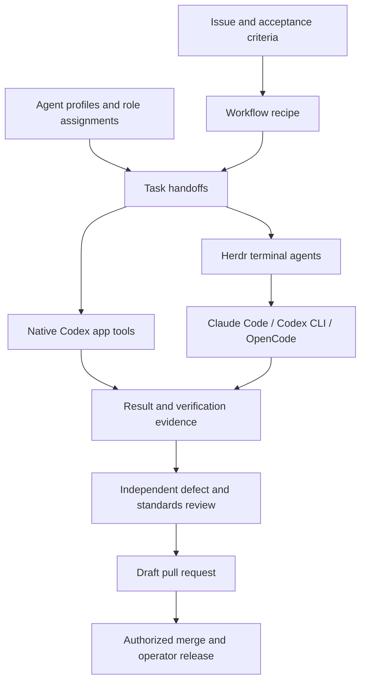

# impstack

**Composable recipes for your code factory.**

Impstack defines how agents receive work, isolate changes, report evidence, and review each other.
Choose agent profiles independently of the workflow. Use native Codex app tools, terminal agents
through Herdr, or an app coordinator with terminal implementation lanes.

The harness owns execution, permissions, authentication, and context. Impstack supplies configuration
validation and task handoffs. It does not start a replacement agent runtime.

The name comes from "imperfect operator." Human review and release decisions remain part of the method.
Backpass is an optional source of corrections, alongside other retrospective tools.

## Get started

- [Configure a factory and validate its handoffs](docs/FACTORY.md).
- [Understand the architecture and its boundaries](docs/HOW-IT-WORKS.md).
- [Install the existing personal preset](docs/INSTALL.md).

The factory CLI runs from this checkout with Python and its standard library.
The existing bootstrap installs the personal skill and harness preset.
Factory module declarations do not change that bootstrap.

```bash
git clone https://github.com/ivankqw/impstack.git ~/impstack
cd ~/impstack
bin/factory --help
```

## Shared method, replaceable tools



| Shared requirement | Replaceable choice |
|---|---|
| Explicit task and acceptance criteria | GitHub, Linear, or a local work record |
| Isolated implementation and review workspaces | Harness worktrees or a worktree helper |
| Recorded profile for each role | Harness, execution method, provider, model, and native options |
| Independent review with executed evidence | Reviewer profile and review tools |
| Durable task result with unresolved work | Native task tools or Herdr with report files |
| Explicit merge authority and operator releases | Repository policy and deployment tooling |
| Corrections remain reviewable | Backpass, reflect, or manual retrospective |

Model names are local choices. Validate them in the selected harness before dispatch.
A valid factory config does not prove model availability or runtime readiness.

## Installation boundary

The existing installer configures Claude Code and Codex instructions, skills, hooks, and MCP declarations.
The OpenCode installer adapter is separate work in [the adapter pull request](https://github.com/ivankqw/impstack/pull/44).
An OpenCode factory profile is a handoff declaration, not proof that its adapter is installed.

Herdr enables the terminal execution path. Native app handoffs do not require Herdr.
The existing bootstrap still restores the Herdr skill as part of the personal preset.
It does not install the Herdr runtime.

See [factory configuration](docs/FACTORY.md) for the executable contract and
[legacy model presets](configs/README.md) for the existing prose configurations.

## skills

I write a skill when no upstream skill covers the job.

<details>
<summary>Skills I own</summary>

| skill | job |
|---|---|
| [`factory-workflow`](skills/factory-workflow/SKILL.md) | Execute selected profiles through native tools or Herdr with verified handoffs. |
| [`cleanup-crew`](skills/cleanup-crew/SKILL.md) | Keep the issue tracker aligned with current work. |
| [`commission`](skills/commission/SKILL.md) | Probe a machine, check its fixed contract, and write its local record. |
| [`dogfood-local`](skills/dogfood-local/SKILL.md) | Run a local app and verify the real user path. |
| [`lane-orchestration`](skills/lane-orchestration/SKILL.md) | Run implementation lanes from briefs through review and cleanup. |
| [`browser-tooling`](skills/browser-tooling/SKILL.md) | Give agent panes browser inspection tools. |
| [`recommission`](skills/recommission/SKILL.md) | Re-probe a machine record and ship at most one proven correction. |

</details>

<details>
<summary>Upstream skills by source</summary>

| source and credit | skills |
|---|---|
| [pstack by Lauren "poteto" Tan, contributors, and Michael Denyer's Claude port](https://github.com/michael-denyer/pstack-claude) | Routing, review, verification, agent workflows, and engineering principles. |
| [Herdr](https://github.com/herdrdev/herdr) | `herdr`. |
| [Matt Pocock](https://github.com/mattpocock/skills) | `ask-matt`, `code-review`, `codebase-design`, `diagnosing-bugs`, `domain-modeling`, `grill-me`, `grill-with-docs`, `grilling`, `handoff`, `implement`, `improve-codebase-architecture`, `prototype`, `research`, `resolving-merge-conflicts`, `setup-matt-pocock-skills`, `tdd`, `teach`, `to-questionnaire`, `to-spec`, `to-tickets`, `triage`, `wait-what`, `wayfinder`, `wizard`, `writing-for-agents`. |
| [Vercel Labs](https://github.com/vercel-labs/skills) | `find-skills`. |
| [Cursor](https://github.com/cursor/plugins) | `deslop`. |
| [Hardik Pandya](https://github.com/hardikpandya/stop-slop) | `stop-slop`. |
| [Microsoft](https://github.com/microsoft/azure-skills) | `microsoft-foundry`. |
| [shadcn](https://github.com/shadcn/improve) | `improve`. |
| [Leon](https://github.com/Leonxlnx/taste-skill) | `brandkit`, `design-taste-frontend`, `high-end-visual-design`, `imagegen-frontend-mobile`, `imagegen-frontend-web`, `image-to-code`, `redesign-existing-projects`. |
| [Peter Bakaus](https://github.com/pbakaus/impeccable) | `impeccable`. |
| [Aiden Bai](https://github.com/aidenybai/react-doctor) | `improve-react`. |
| [Saurabh Kumar](https://github.com/saurabhkumar8112/cyclomatic-complexity-skill) | `cyclomatic-complexity`. |
| [Dietrich Gebert](https://github.com/DietrichGebert/ponytail) | `ponytail-audit`, `ponytail-debt`, `ponytail-gain`, `ponytail-help`, `ponytail-review`. |

</details>

## docs

- [Thesis](docs/THESIS.md) explains the code-factory direction and its boundaries.
- [How it works](docs/HOW-IT-WORKS.md) explains each layer and its source file.
- [Install](docs/INSTALL.md) installs, verifies, updates, and removes the setup.
- [Credits](docs/CREDITS.md) names upstream authors, sources, and licenses.
- [Maintaining](MAINTAINING.md) gives repository editing and verification rules.

Fork this setup and overfit it to yourself. Keep what fits your work and replace my assumptions with
yours.

The repository uses the MIT License. See [LICENSE](LICENSE). `NOTICE` records adapted material.
